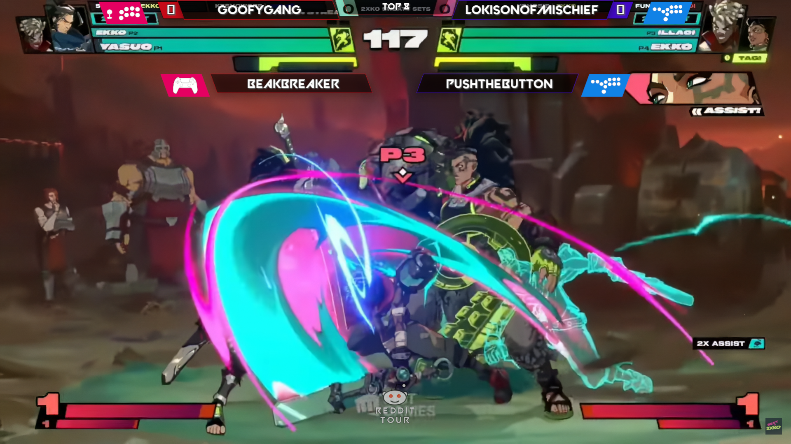

Many thanks to FGC Scoreboard https://github.com/WASD-Gaming/fgc-scoreboard , i just happen to edit some stuffs, especially with upcoming 2XKO, we'll need overlay for 2v2 format
shoutout to https://github.com/tarikfayad 
Most of the instructions here was taken from FGC Scoreboard.


# FGC Scoreboard
FGC Scoreboard is an html and css scoreboard for fighting game tournament streams. It uses absolutely no images (except for tournament/company logos which I've included a generic PSD for) and absolutely no webm files for animations.

## How FGC Scoreboard Works
To get started with FGC Scoreboard just open your streaming platform of choice, add a **broswer source**, and then navigate to wherever you saved the **scoreboard.html** file.

The scoreboard is built to work with StreamControl (included in the repo). All of your data entry should happen through that app including:
```
* Player Names (Player 1  - 4 [for 2XKO])
* Team Names
* Controller
* Round
* Score
* Game
```

To change any of the colors, the font, the opacity, etc. just open the scss file and tweak the variables at the top. There's no need to jump into the rest of the styling unless you want to change something more drastic.

Finally, when you select a game (and hit save) the layout will adjust so that the scores and logos don't cover important guages.
#### Supported Games
```
* BBCF
* BBTAG
* DBFZ
* GGXRD
* KOFXIV
* MVCI
* SFVCE
* TEKKEN7
* UMVC3
* UNICLR
* USF4
* 2XKO
* SF6
```

## Drop Me a Line

## Screenshots
<p align="center">
  
  
  
</p>

## Todo
- [X] Add Tournament overlay 

Pull requests are more than welcomed!

## License
Usage is provided under the [MIT License](http://http//opensource.org/licenses/mit-license.php). See LICENSE for the full details.
